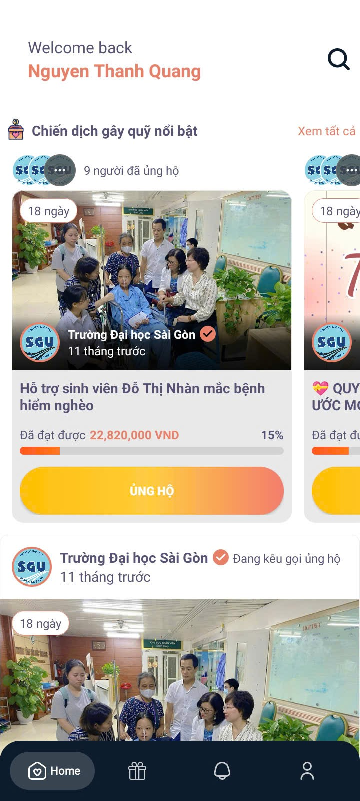
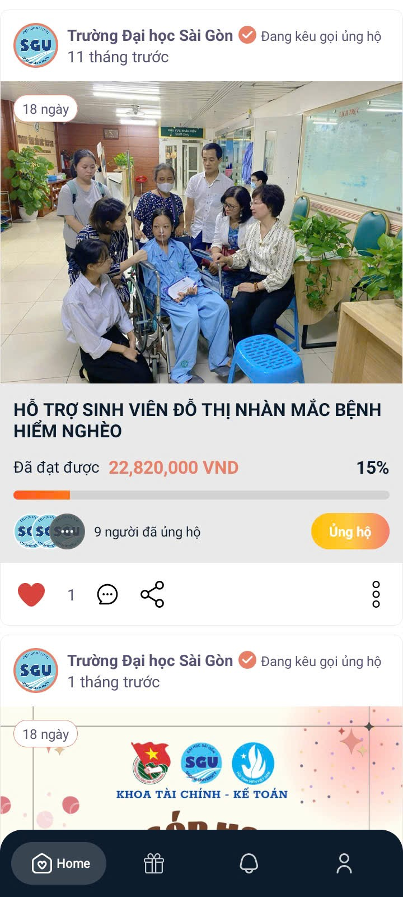
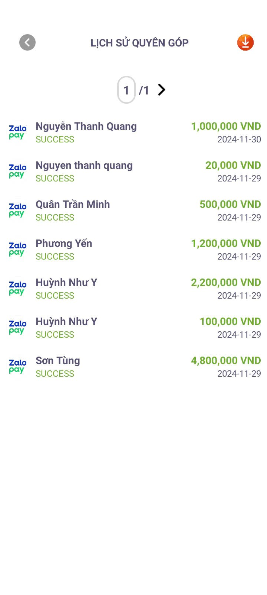

# GivingSGU Android Application

GivingSGU is a mobile application designed to facilitate charity donations within educational institutions. This app is built with Kotlin for Android, with a backend powered by Spring Boot, JWT for authentication, and MySQL for database management. The backend is deployed using Railway for quick and convenient cloud hosting.

## Features

### User Features

1. **Project Browsing**
   - View all active charity projects.
   - Filter and search for specific projects.
   - View detailed information about each project, including:
     - Target amount
     - Current donated amount
     - Remaining days
     - Project description

2. **Donation**
   - Make donations to projects via integrated payment methods:
     - **MoMo Wallet**
     - **ZaloPay**
   - Support for anonymous donations.
   - Real-time updates of donation progress.

3. **Reward System**
   - Earn points for every successful donation.
   - Redeem rewards using accumulated points.
   - View reward history and details.

4. **User Profile**
   - View personal donation history.
   - Manage profile details, including name, faculty, and student ID.

5. **Notifications**
   - Receive updates on donation progress.
   - Alerts for new projects and reward eligibility.

### Admin Features

1. **Project Management**
   - Create, update, and delete projects.
   - Monitor donation statistics for each project.

2. **Transaction Management**
   - Export donation transactions to Excel files.
   - View detailed transaction histories.

3. **Reward System Management**
   - Manage available rewards.
   - Monitor user reward redemptions.

### Backend Features

1. **Authentication**
   - Secure user authentication using JWT.
   - Support for role-based access control (admin and user roles).

2. **Database Management**
   - Centralized database using MySQL.
   - Relationships:
     - Users and Donations
     - Donations and Transactions
     - Projects and Donations

3. **Payment Integration**
   - Seamless integration with MoMo and ZaloPay APIs for handling transactions.

4. **API Documentation**
   - Comprehensive API documentation for seamless integration and testing.

## Screenshots  
### Home Screen  




### Project Details  



 


=

---

## Installation

### Prerequisites

1. Android Studio installed on your system.
2. Backend server deployed (using the provided Spring Boot project).

### Steps

1. Clone the repository.
   ```bash
   git clone https://github.com/quangxyz/GivingSGU.git
   ```

2. Open the project in Android Studio.

3. Update the `baseUrl` in Retrofit configuration to point to your deployed backend server.

4. Build and run the application on an emulator or physical device.

## Backend Deployment

1. Clone the backend repository.
   ```bash
   git clone https://github.com/quangxyz/GivingSGUServer.git
   ```

2. Configure `application.properties` with your MySQL database details.

3. Deploy the server using Railway or any preferred cloud hosting platform.

4. Ensure payment gateway keys for MoMo and ZaloPay are correctly configured.

## Contributing

Contributions are welcome! Please fork the repository and submit a pull request.

## License

This project is licensed under the MIT License.

---

